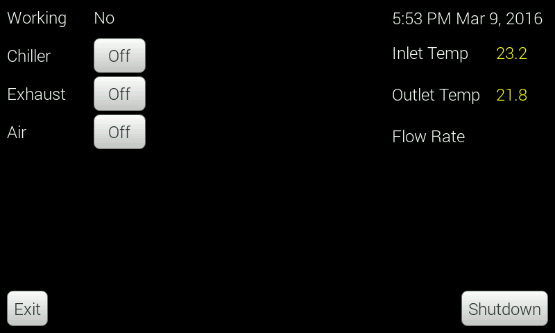

# LaserPi
LaserPi is a Raspberry Pi 2 based auxiliary controller for your laser cutter. Why would you want an auxiliary controller?

LaserPi reads sensor data (temperature, and coolant flow currently) and displays this data on the screen. You can set alarm
information based on the values from the sensors. You can be notified if the temperature goes above a user-defined value, or
if the coolant flow rate goes below a user-defined value. You can also turn on/off your chiller, exhaust, air assist pump,
and lights.

LaserPi can also act upon inputs from your laser controller. Most laser controllers have 4-5 GPIO pins that are set when
the controller is doing certain operations. For example, on the Leetro MPC-6515, output pin 4 is pulled low when the controller
is working. And output pin 1 is pulled low when the air assist box is checked for the layer.

So what can be done with these outputs? LaserPi will automatically turn on your exhaust fan when the laser controller starts
a job, and will keep the exhaust fan running for a user definable period of time after the job is finished to clear away all
the fumes. Have you ever left the air assist box checked by accident and had your air pump turn on when you didn't want it to?
I have, many times and I have to pause my machine and unplug the air assist.

## How does it work?
The brains of the operation is a Raspbery Pi with the code being Python using the QT GUI framework. Data is acquired
from the sensors, and GPIO pins on the Pi, and decisions are made.

###Sensors
*  [Waterproof 1-wire temperature sensors](http://www.aliexpress.com/wholesale?SearchText=waterproof+DS18b20)
*  [YF-S201 fluid flow sensor](http://www.dx.com/p/yf-s201-hall-effect-water-flow-counter-sensor-black-217625)

###Glue components
*  [Logic Level Converter - Bi-Directional](https://www.sparkfun.com/products/12009)
*  [Fotek SSR-25 DA Relays](http://www.amazon.com/dp/B004HZN628)

Here is a work in progress screenshot of LaserPi

